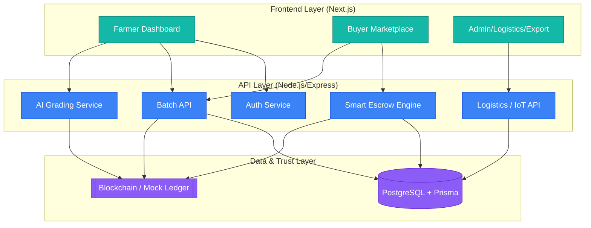

<div align="center">
  
  # VedaLink

  **The Trust Layer for Agri-Commerce**

  *Transforming every batch of produce into a digitally verifiable, traceable, and tradable asset using AI, Blockchain, and Smart Contracts.*

  [](https://opensource.org/licenses/MIT)
  [](https://nextjs.org/)
  [](https://expressjs.com/)
  [](https://postgres.com/)
</div>

<br />

## 📖 The Problem
The agricultural value chain suffers from a massive **trust deficit**. Farmers lose 30-40% of their margin to middlemen because buyers cannot verify quality, origin, or handling conditions. Exporters face 20-30% rejection rates due to missing traceability documentation. This leads to delayed payments (7-15 days) and systemic inefficiencies.

## 🚀 The Solution: VedaLink
VedaLink removes the need for intermediaries by digitizing truth at the farm level. We convert physical produce into a verified digital asset. 

**Core Flow:** *Sense → Verify → Record → Transact → Deliver*

1. **AI Quality Grading**: Smartphone-based edge AI grades produce instantly, replacing subjective human assessment.
2. **Blockchain Traceability**: Every event (harvest, grading, logistics) is permanently recorded on an immutable ledger.
3. **Smart Contract Escrow**: Instant settlement. Buyers lock funds in escrow, which auto-release upon verified delivery.
4. **Digital Export Passport**: 1-click generation of phytosanitary and handling history for global export compliance.

---

## 🏗️ Architecture



---

## 💻 Tech Stack
- **Frontend**: Next.js 15 (App Router), React 19, Tailwind CSS v4, shadcn/ui, Recharts
- **Backend**: Node.js, Express, TypeScript, Zod (Validation), Prisma ORM
- **Database**: PostgreSQL (Dockerized)
- **Blockchain**: TypeScript Chaincode (Hyperledger Fabric architecture simulation)

---

## 📂 Repository Structure
VedaLink is built as a highly modular monorepo:
```text
/
├── apps/
│   ├── web/             # Next.js Application (UI)
│   └── api/             # Express.js REST API
├── packages/
│   ├── shared/          # Shared Zod Schemas & Prisma Types
│   └── blockchain/      # Blockchain ledger interaction client
├── contracts/
│   └── chaincode/       # Smart Contract definitions
└── infra/               # Docker-compose for databases
```

---

## 🛠️ Local Setup Instructions

### Prerequisites
- Node.js (v18+)
- Docker & Docker Compose (for PostgreSQL)

### 1. Start the Database
```bash
# Start PostgreSQL via Docker Compose
cd infra
docker-compose up -d
```

### 2. Install Dependencies
```bash
# Install dependencies across all workspaces
npm install
```

### 3. Database Migration & Seeding
```bash
# Generate the Prisma Client
npx prisma generate

# Push schema to the database
npx prisma db push

# Run the seed script to populate realistic mock data
npm run seed --workspace @vedalink/api
```

### 4. Run the Application
Our workspaces enable seamless full-stack execution:
```bash
# Terminal 1: Start the API Server (runs on port 4000)
npm run dev --workspace @vedalink/api

# Terminal 2: Start the Next.js Frontend (runs on port 3000)
npm run dev --workspace web
```
Visit `http://localhost:3000` to interact with VedaLink!

---

## 🧑‍💻 Sample User Flows (For Demo)
- **Login**: Use the quick-access role switcher provided on `/login` to explore different perspectives seamlessly without manual credential entry.
- **Farmer Flow**: Navigate to the Farmer Dashboard (`/dashboard/farmer`). View recent batches, trigger AI grading, and observe timeline updates.
- **Buyer Flow**: Go to the Buyer Marketplace (`/dashboard/buyer`). Review the quality analytics charts, select an "A Grade" batch, and click to view its Traceability Timeline.
- **Admin/Logistics Flow**: Visit `/dashboard/admin` to see live node activity and the mock distributed ledger event stream.

---

## 🔮 Future Enhancements (Post-Hackathon)
1. **Real Edge AI Models**: Replace the API timeout simulation with a real TensorFlow Lite model compiled to WASM or deployed via Python FastAPI.
2. **Fabric Network Deployment**: Connect the `packages/blockchain` wrapper to a real multi-node Hyperledger Fabric network instead of the in-memory mock.
3. **IoT Sensor Integration**: Expose an MQTT broker endpoint to intake live hardware data from cold-chain trucks.
4. **Localization**: Implement vernacular language support for rural farmers.
